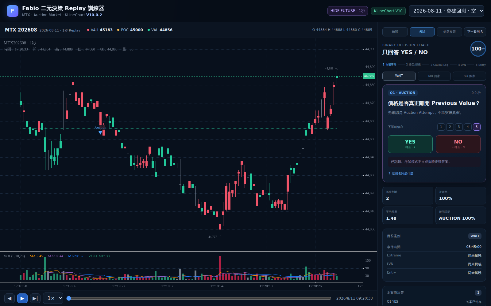

# Fabio 二元決策 Replay 訓練器

以 **KLineChart 10.0.2** 製作的 MTX 主觀交易 Replay 訓練器，把 Fabio-style Auction Market / Volume Profile 思路拆成可以反覆練習的 YES / NO 決策。

> 核心不是猜下一根 K 棒，而是訓練：市場出去試價後，到底是 **被拒絕（Mean Reversion／回家）**、**被接受（Breakout Retest／搬家）**，還是資訊不足應該 **WAIT**。

## Screenshot

### Phase 3 — Training system



前面的階段截圖也保留於 `screenshots/`，所有驗收圖都由 GitHub Actions + Playwright 實際啟動頁面後產生。

## 已完成功能

### Replay
- KLineChart **V10.0.2**（版本鎖定並 vendor）
- 1 秒 Replay fixture + 1 分鐘 fallback cases
- Play / Pause / Step / Back
- 1× / 2× / 4× / 8×
- timeline scrubber
- Previous VAH / POC / VAL
- Volume pane

### Fabio Binary Decision Coach
- Auction Attempt
- Rejection / Acceptance
- Causal Reclaim / Impulse Leg
- Leg Volume Profile / LVN
- First Valid Pullback
- WAIT / MR 回家 / BO 搬家
- Entry / Stop / Target overlay
- Hide Future：每一題只顯示當時可知資料
- Exam mode 在案例完成前不顯示結構答案

### Training
- 練習模式
- 考試模式
- 錯題複習
- YES / NO keyboard shortcuts
- 信心分數 1–5
- LocalStorage 長期紀錄
- 累積判斷
- 正確率
- 平均反應時間
- 最弱決策節點
- 最近錯題

## Uploaded MTX data used for testing

開發階段實際讀取使用者提供的 `MTX_2027.parquet`。

注意：**檔名雖然寫 2027，實際資料日期是 2026。**

QA 結果：
- 2,115,188 Tick rows
- 2026-07-31 15:00:00 → 2026-08-14 13:44:59
- product = MTX
- expiry = 202608
- 此檔沒有價差 expiry
- 原始時間只有秒級
- 同秒交易的實體列順序必須保留
- `side` = Tick Direction proxy，不是真正 Bid/Ask aggressor side

完整報告：[`reports/MTX_2027_DATA_QA.json`](reports/MTX_2027_DATA_QA.json)

資料規則：[`docs/DATA_INTEGRITY.md`](docs/DATA_INTEGRITY.md)

## Run

```bash
npm install
npm run dev
```

Production build：

```bash
npm test
npm run build
npm run preview
```

## Generate replay data from Parquet

```bash
python -m pip install -r requirements-data.txt
python tools/build_replay_data.py /path/to/MTX.parquet -o public/data/mtx_replay.json
```

預設：
- product = MTX
- outright expiry regex = `^\d{6}$`
- `/` spread expiries 排除
- 日盤 08:45–13:45
- Previous Value = 80%
- **不重新排序任何 Tick row**

`tools/build_replay_data.py` 是 Replay/訓練案例 extractor，不是研究最佳化引擎。它不應拿來重新宣稱策略績效。

## Keyboard

| Key | Action |
|---|---|
| `Y` | YES |
| `N` | NO |
| `Space` | Play / Pause |
| `→` | Next bar |
| `←` | Previous bar |
| `R` | Random next case |

## Architecture

```text
MTX Parquet
   ↓  (physical order preserved)
tools/build_replay_data.py
   ↓
Replay fixture
   ↓
KLineChart 10.0.2 setDataLoader
   ↓
Hide-Future state machine
   ↓
Fabio custom overlays
   ↓
Binary Decision Coach
   ↓
TrainerCore / LocalStorage analytics
```

主要檔案：
- `index.html` — app shell
- `src/main.js` — Replay / decision state machine
- `src/overlays.js` — KLineChart Fabio overlays
- `src/trainer-core.js` — persistent analytics
- `src/phase3.js` — practice / exam / review enhancement
- `tools/build_replay_data.py` — Parquet → Replay fixtures
- `tests/` — decision/data invariants

## Decision system

完整 Mermaid tree 與規則：[`docs/DECISION_ENGINE.md`](docs/DECISION_ENGINE.md)

核心：

```text
New price rejected
→ Failed Auction
→ Reclaim Leg
→ Leg LVN
→ First Pullback
→ Mean Reversion

New price accepted
→ Displacement
→ Impulse Leg
→ Leg LVN
→ Pullback + Response
→ Breakout Retest

Unclear
→ WAIT
```

## Research / evidence boundary

本 Trainer 的結構來自本專案之前完成的 Fabio V3/V4 研究經驗。研究中最穩定的 Mean Reversion 版本曾通過 Discovery/Holdout、交易成本、參數平台、cluster bootstrap 與 LVN placebo 等測試。

但是：
1. 本 repo 內附的 2026 短期 fixture 主要是拿來驗證與訓練 UI，**不是新的完整 OOS 績效證明**。
2. `side` 不是 Bid/Ask aggressor，所以真正 Fabio Footprint / CVD / aggression layer 仍然無法由這份資料驗證。
3. 要研究真正 Delta/CVD，需要 Bid/Ask classified trades、TBBO 或 MBO。
4. 這是訓練/研究工具，不是投資建議，也不是保證獲利的自動交易系統。

## Development QA

每個階段都遵循：

```text
Develop
→ Run in browser
→ Playwright screenshot
→ inspect runtime errors
→ fix
→ accept phase
→ next phase
```

規劃與驗收條件：[`docs/DEVELOPMENT_PLAN.md`](docs/DEVELOPMENT_PLAN.md)

## Branch

目前完整開發版：`fabio-replay-v1`

PR 會保持獨立審查，不會在未經確認的情況下自動合併到 `main`。
