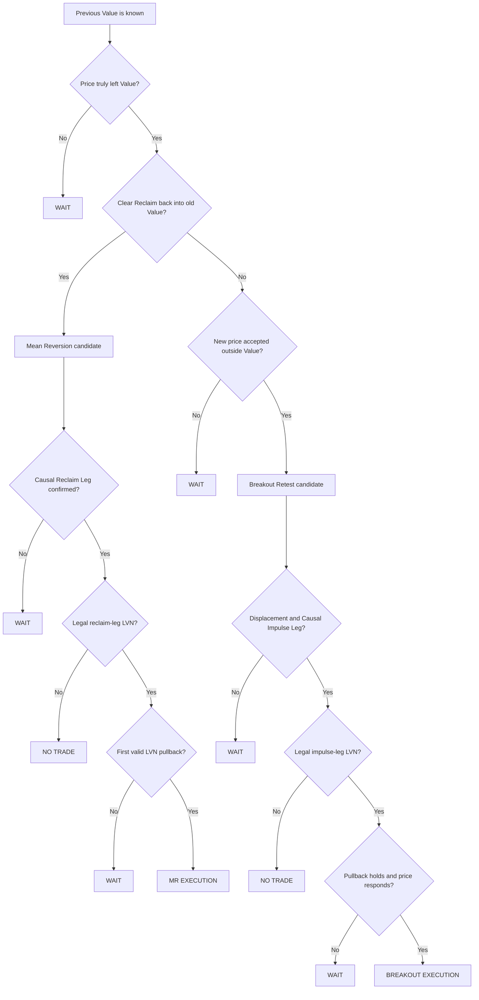

# Fabio Binary Decision Engine

The trainer deliberately does **not** ask “up or down?”. It asks one observable YES/NO question at a time.

## Mean Reversion — 回家
Training reference derived from the corrected V3/V4 research:
- previous-day 80% Value Area
- failed auction excursion ≈ at least 2% of Value Width
- clear reclaim ≈ 8% of Value Width within about 60 seconds
- causal reclaim leg requires a meaningful turn (reference: about 8 points in the MTX research)
- profile only the causal reclaim leg
- use a valley-style LVN
- first legal LVN pullback
- reference structural stop ≈ 6 points (robust region 4–8)
- reference target ≈ 0.75R (robust region 0.5–1R)
- reference time stop ≈ 300 seconds (robust region 180–600)

The trainer treats these as **training reference parameters**, not universal market constants.

## Breakout Retest — 搬家
- price truly leaves old Value
- no fast clear reclaim
- new prices remain accepted outside old Value
- meaningful displacement
- causal impulse leg is formed before profiling
- find an impulse-leg LVN
- wait for pullback
- require the pullback to stop and price to respond in the breakout direction
- structural invalidation is more important than an arbitrary fixed-point stop

Trend/Breakout currently has less holdout evidence than Mean Reversion in the underlying research, so the trainer labels it as lower-confidence practice material.

## Formal states
- **WAIT**: information is not mature yet; the setup may still develop.
- **NO TRADE**: a required condition failed; abandon the setup.
- **MR**: new price was rejected; trade the first reliable rotation back toward old Value.
- **BO**: new price was accepted; trade a pullback into the newly established direction.

## Scoring philosophy
The learner is scored on the quality of the decision process, not whether the next candle happened to make money.

Tracked dimensions:
- Auction recognition
- Rejection / Acceptance
- Causal Leg recognition
- LVN location
- Entry quality
- response time
- confidence calibration
- MR vs BO branch accuracy
